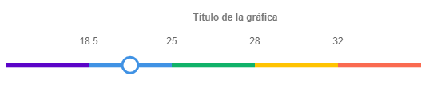
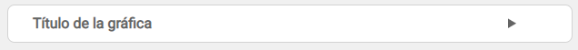
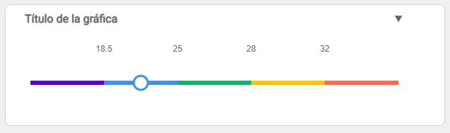

# Chart1D
Generador de gráficas en "1 dimensión" utilizando Chart.js. 

## ¿Cómo se utiliza?
Por cada gráfica a generar se debe crear una nueva instancia del objeto Chart1D. 

Los parrámetros a pasar en la generación del objeto son los siguientes:
1. `id` (obligatorio): string identificador del canvas de la gráfica dentro del código HTML.
2. `title` (obligatorio): string con el valor del título de la gráfica. 
3. `scale` (obligatorio): array con los valores numéricos de la escala de la gráfica a generar.
4. `scaleColors` (opcional): array de strings con los textos de los colores de la escala de la gráfica a generar. Se puede pasar el valor como texto en hexadecimal o bien utilizar el string de los [colores predefinidos](README.md#Strings-de-colores).

Una vez generado el objeto, para visualizar el valor en el gráfico se debe utilziar la función `show()`, pasando como parámetro el valor que se quiere mostrar. 

En caso de que no se le pase ningún valor a la función `show()` se mostrará únicamente el eje del gráfico.

## Ejemplos

En ambos ejemplos, el código Javascript utilizado es el siguiente:

**Javascript**

En el código javascript se define el nuevo objeto como:
```javascript
const scale = [18.5, 25, 28, 32];
const scaleColors = ['purple', '#4092e4', 'green', 'yellow', 'red'];
let value = 20;

let chart = new Chart1D('myChart', 'Título de la gráfica', scale, scaleColors);
chart.show(value);
```

### Ejemplo sin animación

Para generar una gráfica sin animaciones se debe utilizar la siguiente estructura en HTML:

```HTML
<div class="chart-container">
	<canvas id="myChart" width="600" height="100" class="chart1D"></canvas>
</div>
```
El `id` del canvas será el que se pasará en la generación del nuevo objeto.

Se genera el siguiente objeto:




### Ejemplo con animación

Para generar una gráfica con animaciones se debe utilizar la siguiente estructura en HTML:
```HTML
<div class="chart-container">
	<details>
		<summary id="myChartSummary"></summary>
		<canvas id="myChart" width="600" height="100" class="chart1D"></canvas>
</div>
```
El `id` del canvas será el que se pasará en la generación del nuevo objeto. El `id` del summary debe ser la concatenación del `id` del canvas con el texto 'Summary'.


Se genera el siguiente objeto:



Si se pulsa encima se muestra el gráfico completo:



## Limitaciones
Este generador de gráficas tiene la siguientes limitaciones:

1. Puede mostrar un máximo de 10 secciones. 
Esto es modificable, permitiendo ampliar el valor máximo si se incorporan más objetos dentro de `data.datasets`, en esta versión tiene 10 datasets iniciales definidos.

2. Solo puede mostrar el valor de la gráfica en dos tipos de punto:
    1. Valor que coincide con un valor de la escala: en este caso el valor se muestra en el valor correspondiente.
    2. Valor intermedio entre dos valores de escala: en este caso el valor se muestra en el centro los dos puntos de la escala en los que está comprendido.

3. El rango de valores que se acepta para la escala es:
    * Mínimo: 0
    * Máximo: 99

## Strings de colores

Dentro de `scaleColors` además del string con el valor hexadecimal se pueden pasar los siguientes literales, correspondientes a los colores predefinidos en el generador de gráficos:

| Nombre      | Valor hexadecimal |
|-------------|-------------------|
| cyan        | #00ffff           |
| lightBlue   | #70cfff           |
| blue        | #4092e4           |
| darkBlue    | #2377cd           |
| lightGreen  | #73f0b8           |
| green       | #10b269           |
| darkGreen   | #067543           |
| lightYellow | #ffeaa6           |
| yellow      | #ffc301           |
| darkYellow  | #a67f00           |
| lightOrange | #fcbf79           |
| orange      | #f28d19           |
| brown       | #854700           |
| red         | #fa6a50           |
| pink        | #ff00d0           |
| white       | #ffffff           |
| purple      | #5b04c8           |
| black       | #000000           |