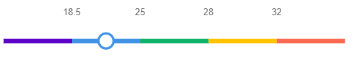

# Chart1D
Generador de gráficas en 1 dimensión utilizando Chart.js

## ¿Cómo se utiliza?
Por cada gráfico a generar se debe crear una nueva instancia del objeto Chart1D. 

Los parrámetros a pasar en la generación del objeto son los siguientes:
1. `id`: string identificador del canvas del gráfico dentro del código HTML
2. `scale`: array con los valores numéricos de la escala del gráfico a generar
3. `scaleColors`: array de strings con los textos de los colores de la escala del gráfico a generar.

Una vez generado el objeto, para visualizar el valor en el gráfico se debe utilziar la función `show()`, pasándo como parámetro el valor que se quiere mostrar.

## Ejemplo
En el código HTML se define un nuevo canvas:
```javascript
<canvas id="myChart" width="500" height="80"></canvas>
```

En el código javascript se define el nuevo objeto como:
```javascript
const scale = [18.5, 25, 28, 32];
const scaleColors = ['purple', 'blue', 'green', 'yellow', 'red'];
let value = 20;

let chart = new Chart1D('myChart', scale, scaleColors);
chart.show(value);
```

Esto genera el siguiente gráfico:

